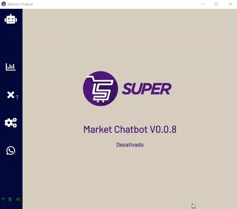
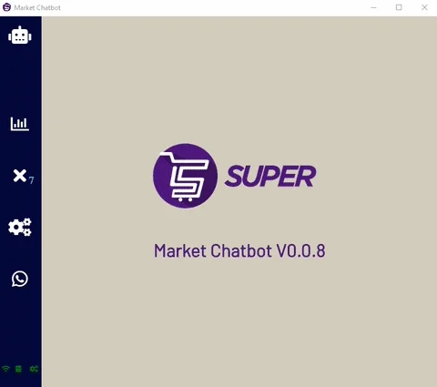
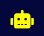
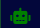
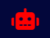

<a name="TOC"></a>

<h3 align="center">
  SUPERMARKET CHATBOT
</h3>

<div align="center">
  <a href="https://www.electronjs.org/"></a>
  <a href="https://www.github.com/lucasvtiradentes/supermarket-chatbot/commits/master"></a>
  <br>
  <a href="#"></a>
  <a href="https://www.github.com/lucasvtiradentes"></a>
  <a href="https://github.com/lucasvtiradentes/supermarket-chatbot#contributing"></a>
</div>

<p align="center">
  <a href="#dart-features">Features</a> • <a href="#warning-requirements">Requirements</a> • <a href="#bulb-usage">Usage</a> • <a href="#wrench-development">Development</a> • <a href="#books-about">About</a> • <a href="#family-community">Community</a>
</p>

<details>
  <summary align="center"><span>see <b>table of content</b></span></summary>
  <p align="center">
    <ul>
      <!-- <li><a href="#trumpet-overview">Overview</a></li> -->
      <!-- <li><a href="#pushpin-table-of-contents">TOC</a></li> -->
      <li><a href="#dart-features">Features</a></li>
      <li><a href="#warning-requirements">Requirements</a></li>
      <li>
        <a href="#bulb-usage">Usage</a>
        <ul>
          <li><a href="#installation">Installation</a></li>
          <li><a href="#keyboard-shortcuts">Keyboard shortcuts</a></li>
          <li><a href="#program-icon-meaning">Program icon meaning</a></li>
        </ul>
      </li>
      <li>
        <a href="#wrench-development">Development</a>
        <ul>
          <li><a href="#development-setup">Development setup</a></li>
          <li><a href="#folders-and-files-structure">Folders and files structure</a></li>
          <li><a href="#used-technologies">Used technologies</a></li>
          <li><a href="#commit-messages-style">Commit messages style</a></li>
        </ul>
      </li>
      <li>
        <a href="#books-about">About</a>
        <ul>
          <li><a href="#license">License</a></li>
        </ul>
      </li>
      <li>
        <a href="#family-community">Community</a>
        <ul>
          <li><a href="#contributing">Contributing</a></li>
          <li><a href="#feedback">Feedback</a></li>
        </ul>
      </li>
    </ul>
  </p>
</details>

<a href="#"></a>

## :trumpet: Overview

This is an auto-updatable elctron whatsapp chatbot made for sending supermarket customers warning and informative messages whenever needed.

<p align="center">
  <table align="center" style="width: 100%">
    <tr>
      <td style="text-align: center; font-weight: bold;">Program tour</td>
      <td style="text-align: center; font-weight: bold;">Sending messages</td>
    </tr>
    <tr>
      <td></td>
      <td></td>
    </tr>
 </table>
</p>

## :dart: Features<a href="#TOC"></a>

&nbsp;&nbsp;&nbsp;✔️ Automatic updates, by using [Electron-build](https://www.electron.build/) and [AWS S3](https://aws.amazon.com/pt/s3);<br>
&nbsp;&nbsp;&nbsp;✔️ Keyboard shortcuts for easier customer experience;<br>
&nbsp;&nbsp;&nbsp;✔️ Indication of the current operation that the bot performs on the icon at the top left;<br>
&nbsp;&nbsp;&nbsp;✔️ Indication if the user has the required conditions for the bot to operate in the lower left part icons;<br>
&nbsp;&nbsp;&nbsp;✔️ Indication of the number of messages sent, both on the current day and throughout the period;<br>
&nbsp;&nbsp;&nbsp;✔️ Indication of how many pending messages the bot is sending, so that there is a number next to the `whatsapp icon`;<br>
&nbsp;&nbsp;&nbsp;✔️ Indication of how many messages the bot operator should contact to inform customers, with a number next to the `manual messages icon`;<br>
&nbsp;&nbsp;&nbsp;✔️ List of customers who must be contacted manually because they don't have a whatsapp number. In addition, the content of the generated message is shown, allowing quick communication of incidents to customers.<br>

Other use cases:

&nbsp;&nbsp;&nbsp;✔️ It is possible to define a user to be responsible for *N* market;<br>
&nbsp;&nbsp;&nbsp;✔️ If one day we have the KEY to use the Whatsapp Business API, we can only change the way of sending messages to customers;<br>
&nbsp;&nbsp;&nbsp;✔️ If you run the program from a terminal, it is possible to see auxiliary log messages.<br>

## :warning: Requirements<a href="#TOC"></a>

### softwares needed

In order to use this project in your computer, you need to have the following items:

- [npm](https://www.npmjs.com/): To install the package. Npm is installed alongside nodejs;
- [nodejs](https://nodejs.org/en/): To actually run the package.

If you want to make changes to the source code, it is recommended to also install the following items:

- [git](https://git-scm.com/): To work with version controlling;
- [vscode](https://code.visualstudio.com/): Useful for editing the code. You can choose a similar editor as you wish.

### messages in database

> **Warning** In order to this app be useful, you'll have to store the messages you want to send to the costumers in a mongodb collection.

In order to send messages for supermaket clients in supermarket-chatbot, you'll need to store the messages in a database with the following JSON content:

```json
{
  "token": "___",
  "message_content": {
    "customer_name": "Iracema Sousa Barroso",
    "customer_phone": "(98) 98118-4923",
    "market_name": "Mateus Renascença   🛒",
    "market_id": "237a2010-2f46-4424-b5e8-d209aaa8a169",
    "message_type": "############",
    "order_number": "20200725105555",
    "order_date": "25/07/2020",
    "order_time": "15:07",
    "order_products": [
      [
          "Sku: 1077 - Código de barras: 7891080400599",
          "Margarina Cremosa com Sal",
          "-",
          "1",
          "3,190",
          "1",
          "3,190",
          "",
          "-",
          "-",
          "-"
      ],
      [
          "Sku: 100179 - Código de barras: 7896369619228",
          "Manteiga de Palma",
          "-",
          "1",
          "6,670",
          "1",
          "6,670",
          "",
          "-",
          "-",
          "-"
      ]
    ]
  }
}
```

You need to replace the content of `message_type` according to the orders's position in the order step in the funnel. The possible options are shown in the next table:

<div align="center" style="text-align: center;">
  <table>
    <tr>
      <th>message_type</th>
      <th>when to send</th>
      <th>content</th>
    </tr>
    <tr>
      <td>greeting</td>
      <td>authorized request
</td>
      <td align="left">Hello super customer, the separation of your order has started, so we will contact you if any product is temporarily out of stock on the market.</td>
    </tr>
    <tr>
      <td>occurrences</td>
      <td>processed order</td>
      <td align="left">Hello super customer, your order has the following occurrences: x, y, z. In this way, below is the updated value of your purchases.</td>
    </tr>
    <tr>
      <td>ready_for_pickup</td>
      <td>ready to pick up</td>
      <td align="left">Hello super customer, your order is ready for pickup.</td>
    </tr>
  </table>
</div>

The messages can be denied to be add in the database in the following cases:
- Unsuccessful attempt to add message, invalidated due to incompatible token;
- Unsuccessful attempt to add a message, invalidation because it already exists in the database;
- Unsuccessful attempt to add a message, invalidation due to the message not having the appropriate fields in the object.

## :bulb: Usage<a href="#TOC"></a>

### Keyboard shortcuts

<div align="center">
  <table>
    <tr>
      <th>Shotcut</th>
      <th>Action</th>
    </tr>
    <tr>
      <td>Ctrl + 1</td>
      <td align="left">Go to the  dashboard screen.</td>
    </tr>
    <tr>
      <td>Ctrl + 2</td>
      <td align="left">Go to the manual messages screen.</td>
    </tr>
    <tr>
      <td>Ctrl + 3</td>
      <td align="left">Go to the settings screen.</td>
    </tr>
    <tr>
      <td>Ctrl + 4</td>
      <td align="left">Go to the whatsapp screen.</td>
    </tr>
    <tr>
      <td>Ctrl + H</td>
      <td align="left">Vai para a tela home.</td>
    </tr>
    <tr>
      <td>Ctrl + U</td>
      <td align="left">Check chatbot updates.</td>
    </tr>
    <tr>
      <td>Ctrl + G</td>
      <td align="left">Change the dashboard charts view mode.</td>
    </tr>
    <tr>
      <td>Ctrl + R</td>
      <td align="left">Restart the program.</td>
    </tr>
    <tr>
      <td>Ctrl + F4</td>
      <td align="left">Closes the program.</td>
    </tr>
    <tr>
      <td>Ctrl + Space</td>
      <td align="left">Toogles the bot, turn it on/off.</td>
    </tr>
  </table>
</div>

### Program icon meaning

<div align="center">
  <table>
    <tr>
      <th>Image</th>
      <th>Current operation</th>
    </tr>
    <tr>
      <td></td>
      <td align="left">Bot is turned off.</td>
    </tr>
    <tr>
      <td></td>
      <td align="left">Turning the bot on.</td>
    </tr>
    <tr>
      <td></td>
      <td align="left">Looking for new messages.</td>
    </tr>
    <tr>
      <td></td>
      <td align="left">Sending messages.</td>
    </tr>
    <tr>
      <td></td>
      <td align="left">Bot is not working.</td>
    </tr>
  </table>
</div>


## :wrench: Development<a href="#TOC"></a>

### Development setup

To setup this project in your computer, download it in this link or run the following commands:

```bash
# Clone this repository
$ git clone https://github.com/lucasvtiradentes/supermarket-chatbot

# Go into the repository
$ cd supermarket-chatbot
```

After download it, go to the project folder and run these commands:

```bash
# Install dependencies
$ npm install

# Run the typescript code in development mode
$ npm run dev
```

**To build an installable binary**, run the following command:
```bash
# Build the binary install setup
npm run build
```

To effectvly use the auto-update feature, you'll have to publish the install to an amazon S3 property. And to do that, make sure to:
- Create an AWS S3 property to this chatbot;
- Update package.json `build` settings to use your S3 property;
- Get the credentials and setup in your computer.

### Folders and files structure

The project has the following folder strucure:

```plain
|-- .github      # contains CI-CD workflows, github templates, DOCS and images.
|-- build        # (dev only) build folder
|-- node_modules # (dev only) dependencies folder
|-- scripts      # scripts folder
|-- src          # application source code
```

and the filles present in root folder are the following:

```plain
.editorconfig    # editorconfig settings file
.env             # environmental variables
.env.example     # environmental variables example
.gitignore       # git ignored items
LICENSE          # project license
package.json     # project specifications
tsconfig.json    # typescript settings file
```

### Used technologies

This project uses the following thechnologies:

<div align="center">
  <table>
    <tr>
      <th>Scope</th>
      <th>Subject</th>
      <th>Technologies</th>
    </tr>
    <tr>
      <td rowspan="2">Main</td>
      <td>Main</td>
      <td align="center">
        <a href="https://nodejs.org/"></a>
        <a target="_blank" href="https://www.electronjs.org/"></a>
      </td>
    </tr>
    <tr>
      <!-- <td rowspan="1">Main</td> -->
      <td>Secondary</td>
      <td align="center">
        <a target="_blank" href="https://aws.amazon.com/"></a>
        <a target="_blank" href="https://www.mongodb.com/"></a>
      </td>
    </tr>
    <tr>
      <td rowspan="3">Setup</td>
      <td>Code linting</td>
      <td align="center">
        <!-- <a href="https://github.com/prettier/prettier"></a> -->
        <a href="https://github.com/eslint/eslint"></a>
      </td>
    </tr>
    <tr>
      <!-- <td rowspan="2">Setup</td> -->
      <!-- <td>Commit linting</td> -->
      <!-- <td align="center"> -->
      <!-- <a target="_blank" href="https://github.com/conventional-changelog/commitlint"></a> -->
      <!-- <a target="_blank" href="https://github.com/commitizen/cz-cli"></a> -->
      <!-- <a href="https://gitmoji.dev"></a> -->
      <!-- </td> -->
    <!-- </tr> -->
    <tr>
      <!-- <td rowspan="1">Setup</td> -->
      <td>Other</td>
      <td align="center">
        <a href="https://editorconfig.org/"></a>
        <!-- <a target="_blank" href="https://github.com/typicode/husky"></a> -->
        <!-- <a target="_blank" href="https://github.com/okonet/lint-staged"></a> -->
      </td>
    </tr>
  </table>
</div>

And also this project used the following packages:

```plain
# DEPENDENCIES

- chart.js         # create beautiful charts.
- dotenv           # read .env variables.
- electron-is-dev  # detects if is running in dev mode.
- electron-store   # stores information on a computer folder.
- electron-updater # adds auto-updatable feature.
- http2            # make https requests.
- mongodb          # deal with mongodb database.

# DEV DEPENDENCIES

- electron         # app main engine.
- electron-builder # compiles the application into executables.
- eslint           # lint the code.
```

### Commit messages style

This project uses the best of two main conventions to commit messages validation:

- [conventional commits](https://www.conventionalcommits.org/en/v1.0.0/): it's powerfull messages structure;
- [gitmoji](https://gitmoji.dev/): it's beutiful and visual way to display commits.

So a typically valid commit message has this pattern:

> 🔧 config: add lint-staged to the project (#2)

Also, in order to have this integration working correctly, I buld a [script](../scripts/update-commits-configs.ts) that we can specify only allowed types and it take care to update both commitizen and commitlint settings.

### How it works


__Operation details__

- Each user can only operate if they have a validation key, which are registered in a `collection` in the database;
- Due to the asynchronous nature of electron, the operations of stopping and activating the bot are not instantaneous, so these intermediate states were introduced in the application.

__About the structure of the bot__

- The bot's folder structure is heavily influenced by the asynchronous nature of electron, which in a nutshell doesn't "wait" for the output of commands.
- Therefore, the project was divided into three parts:
  - __interface_window__: it's the look of the program, responsible for the settings part and for hosting the `webview` of whatsapp.
  - __worker_window__: Invisible window responsible for searching messages in the database parallel to the interface. It was created with the intention of not blocking the `window interface` during synchronous database queries.
  - __main__: responsible for orchestrating the program, making the connection between `interface` and `worker`. It, for example, receives the results of the `worker` query and evaluates whether or not it has messages.

__About message search__

- In a simple way, after checking if the necessary conditions (internet, database and settings) are satisfied, the bot is continuously checking if there are pending messages in the database.
  - If they exist, it sends an `event` to the `interface` to send the messages;
  - If they don't exist, it waits a certain amount of time (defined in `configs.json`) before checking again.

__About sending messages__

- When the array of messages arrives to be sent, a check is made if in fact the message should be sent.
  - If yes, try to send the message;
  - Otherwise, the status of the message is changed from `pending` to `unrequired` in the database. An example of a message that does not need to be sent is when the order has no occurrences.
- When trying to send the message:
  - if the customer number does not exist, the status of the message is changed from `pending` to `error`, in addition to this order being saved locally in the market, which can be consulted in the `manual orders` tab;
  - if there is a customer number, the bot waits until the message is actually sent. To do so, it performs a loop waiting for the last message sent by the user to be the same as the one he theoretically should send, in addition to checking whether the message has a `check` or `double check`.
- When you finish sending the message, change the message status from `pending` to `sent`.

__About updating tables and charts__

- Tables are updated:
  - At the beginning of an attempt to send a message to a customer;
  - When a client is added to the `manual clients` category.
- Graphics are updated:
  - At the beginning of an attempt to send a message to a customer;
  - When changing the graphics content (`CTRL+G`).

__About non-recommended actions and possible errors__

It is not advisable to close the bot right after sending a message, since it is possible that its status in the database has not yet been changed to `sent`, which could cause the client to receive the same message.

<a href="#"></a>

## :books: About<a href="#TOC"></a>

## License

**Boilermanager** is distributed under the terms of the MIT License Version 2.0. A complete version of the license is available in the [LICENSE](LICENSE) file in this repository. Any contribution made to this project will be licensed under the MIT License Version 2.0.

<a href="#"></a>

## :family: Community<a href="#TOC"></a>

## Contributing

If you want to positivily impact this project, consider to:

- **:star: Star this repository**: my goal is to impact the maximum number of developers around the world;
- ✍️ **Fix english mistakes** I might have made in this project, may it be in the DOCS or even in the code (I'm a portuguese natural speaker);
- [:heart: Say thanks](https://saythanks.io/to/lucasvtiradentes): kind words have a huge impact in anyone's life;
- [💰 Donate](https://github.com/lucasvtiradentes): if you want to support my work even more, consider make a small donation. I would be really happy!

## Feedback

Any questions or suggestions? You are welcome to discuss it on:

- [Github issues](https://github.com/lucasvtiradentes/supermarket-chatbot/issues)
- [Email](mailto:lucasvtiradentes@gmail.com)

<a href="#"></a>

<div align="center">
  <p>
    <a target="_blank" href="https://www.linkedin.com/in/lucasvtiradentes/"></a>
    <a target="_blank" href="mailto:lucasvtiradentes@gmail.com"></a>
    <a target="_blank" href="https://discord.com/users/262326726892191744"></a>
    <a target="_blank" href="https://github.com/lucasvtiradentes/"></a>
  </p>
  <p>Made with ❤️ by Lucas Vieira.</p>
  <p>👉 See also all <a href="https://github.com/lucasvtiradentes/lucasvtiradentes/blob/master/portfolio/PROJECTS.md#TOC">my projects</a></p>
  <p>👉 See also all <a href="https://github.com/lucasvtiradentes/my-tutorials#readme">my articles</a></p>
</div>
